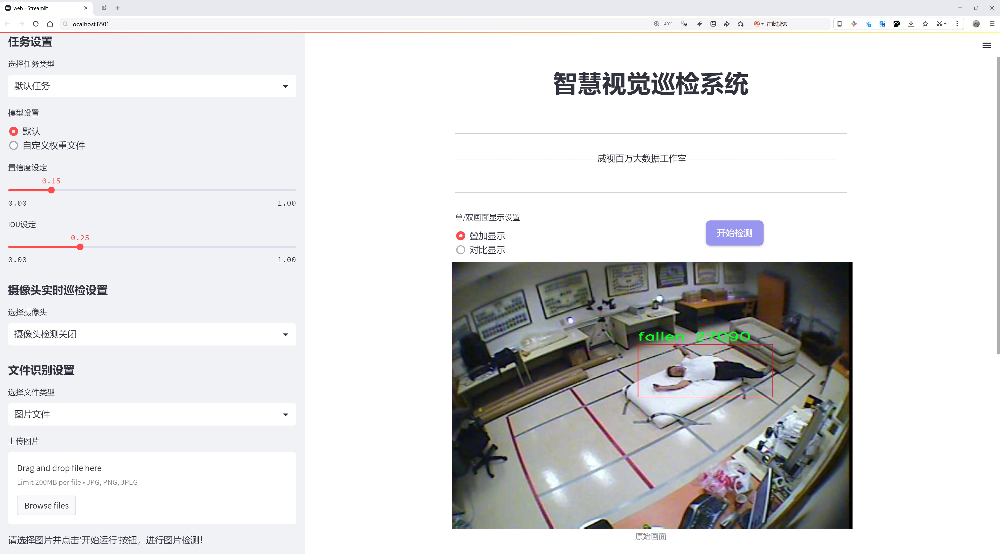
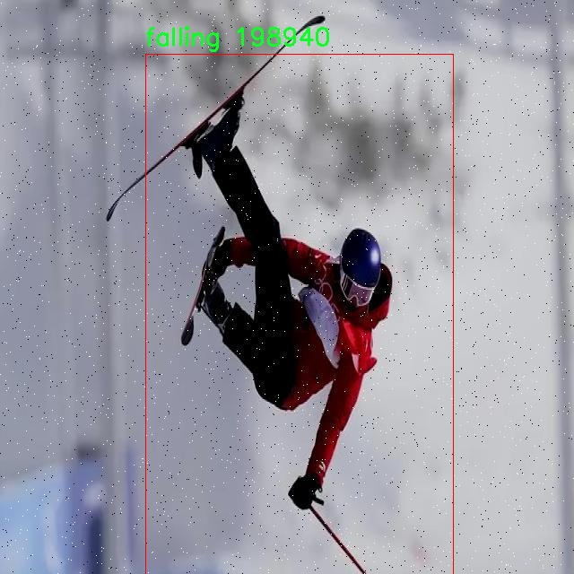
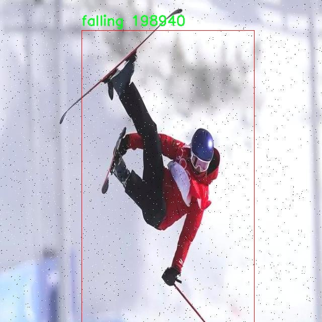

# 跌倒过程检测检测系统源码分享
 # [一条龙教学YOLOV8标注好的数据集一键训练_70+全套改进创新点发刊_Web前端展示]

### 1.研究背景与意义

项目参考[AAAI Association for the Advancement of Artificial Intelligence](https://gitee.com/qunshansj/projects)

项目来源[AACV Association for the Advancement of Computer Vision](https://gitee.com/qunmasj/projects)

研究背景与意义

随着全球老龄化进程的加速，跌倒已成为老年人群体中一种常见且严重的健康问题。根据世界卫生组织的统计，全球每年约有三分之一的老年人经历跌倒事件，跌倒不仅可能导致骨折、脑震荡等身体伤害，还可能引发一系列心理问题，如焦虑和抑郁。因此，开发有效的跌倒检测系统，对于提高老年人的生活质量、减少医疗成本、保障其安全具有重要的现实意义。

近年来，计算机视觉和深度学习技术的迅猛发展为跌倒检测提供了新的解决方案。YOLO（You Only Look Once）系列模型因其高效的实时目标检测能力，逐渐成为各类视觉任务中的热门选择。YOLOv8作为该系列的最新版本，结合了更先进的特征提取和处理机制，能够在保持高准确率的同时，显著提高检测速度。然而，尽管YOLOv8在多种目标检测任务中表现优异，但在特定应用场景下，如跌倒检测，仍然存在一定的挑战。这主要体现在对跌倒过程的动态变化捕捉能力不足、环境复杂性导致的误检和漏检等问题。

为了解决上述问题，本研究提出了一种基于改进YOLOv8的跌倒过程检测系统。该系统的设计目标是通过对YOLOv8模型进行优化，使其在处理跌倒检测任务时能够更准确地识别和分类跌倒的不同阶段，包括“站立”、“下跌”和“已跌倒”三类状态。为此，我们将利用一个包含3888张图像的数据集，该数据集涵盖了三种跌倒相关的类别。这些图像的多样性和丰富性为模型的训练提供了良好的基础，使其能够在各种环境和条件下进行有效的检测。

本研究的意义不仅在于提升跌倒检测的准确性和实时性，更在于为老年人提供一种安全保障机制。通过及时检测和识别跌倒事件，相关人员可以迅速采取行动，提供必要的帮助，减少跌倒带来的潜在伤害。此外，该系统的应用还可以为家庭和护理机构提供数据支持，帮助他们更好地管理老年人的日常活动，预防跌倒的发生。

总之，基于改进YOLOv8的跌倒过程检测系统的研究，不仅具有重要的学术价值，也为实际应用提供了可行的解决方案。通过对跌倒检测技术的深入探索，我们希望能够为老年人群体的安全和健康贡献一份力量，同时推动计算机视觉技术在医疗健康领域的进一步发展。

### 2.图片演示




##### 注意：由于此博客编辑较早，上面“2.图片演示”和“3.视频演示”展示的系统图片或者视频可能为老版本，新版本在老版本的基础上升级如下：（实际效果以升级的新版本为准）

  （1）适配了YOLOV8的“目标检测”模型和“实例分割”模型，通过加载相应的权重（.pt）文件即可自适应加载模型。

  （2）支持“图片识别”、“视频识别”、“摄像头实时识别”三种识别模式。

  （3）支持“图片识别”、“视频识别”、“摄像头实时识别”三种识别结果保存导出，解决手动导出（容易卡顿出现爆内存）存在的问题，识别完自动保存结果并导出到tempDir中。

  （4）支持Web前端系统中的标题、背景图等自定义修改，后面提供修改教程。

  另外本项目提供训练的数据集和训练教程,暂不提供权重文件（best.pt）,需要您按照教程进行训练后实现图片演示和Web前端界面演示的效果。

### 3.视频演示

[3.1 视频演示](https://www.bilibili.com/video/BV1gD4Ue7ENb/)

### 4.数据集信息展示

##### 4.1 本项目数据集详细数据（类别数＆类别名）

nc: 3
names: ['fallen', 'falling', 'standing']


##### 4.2 本项目数据集信息介绍

数据集信息展示

在本研究中，我们使用了名为“fall_detection”的数据集，以改进YOLOv8模型在跌倒过程检测系统中的表现。该数据集专门针对跌倒事件的检测而设计，涵盖了三种主要类别，分别是“fallen”（已跌倒）、“falling”（正在跌倒）和“standing”（站立）。这些类别的划分不仅有助于模型在不同状态下的准确识别，还为进一步的分析和应用提供了基础。

“fall_detection”数据集的构建考虑到了现实生活中的多样性和复杂性。跌倒事件是老年人群体中常见的意外事故，及时准确地检测出跌倒的状态对于预防和减少伤害至关重要。因此，该数据集包含了丰富的场景和姿态变化，以确保模型能够在各种环境中有效工作。数据集中不仅包括不同年龄段、性别和体型的个体，还涵盖了多种室内和室外环境，如家庭、医院、公共场所等。这种多样性使得模型在训练过程中能够学习到更多的特征，从而提高其在实际应用中的鲁棒性。

在数据采集过程中，研究团队采用了高质量的视频录制设备，以确保捕捉到清晰的图像和流畅的动作。这些视频片段经过精心标注，确保每个类别的样本数量均衡，且标注的准确性高。通过对每个视频帧进行详细的标注，研究人员能够为模型提供精确的训练数据，从而提高其识别能力。此外，数据集还包含了不同光照条件、视角和背景的变化，以模拟真实世界中可能遇到的各种情况。

为了增强模型的泛化能力，数据集还进行了数据增强处理，包括旋转、缩放、裁剪和颜色调整等。这些处理不仅增加了数据的多样性，还帮助模型在面对未见过的样本时，能够更好地进行预测。通过这些措施，我们期望模型能够在实际应用中具备更高的准确性和稳定性。

在训练过程中，YOLOv8模型将利用“fall_detection”数据集中的标注信息，学习如何区分三种状态。模型将通过分析视频帧中的特征，识别出个体的姿态变化，并判断其当前状态。这一过程不仅依赖于图像处理技术，还涉及到深度学习算法的优化，以确保模型能够快速、准确地进行实时检测。

总之，“fall_detection”数据集为改进YOLOv8的跌倒过程检测系统提供了坚实的基础。通过丰富的样本、多样的场景和精确的标注，我们相信该数据集将极大地提升模型的性能，使其在实际应用中能够有效地识别和响应跌倒事件，从而为老年人群体的安全提供更为可靠的保障。







### 5.全套项目环境部署视频教程（零基础手把手教学）

[5.1 环境部署教程链接（零基础手把手教学）](https://www.ixigua.com/7404473917358506534?logTag=c807d0cbc21c0ef59de5)


[5.2 安装Python虚拟环境创建和依赖库安装视频教程链接（零基础手把手教学）](https://www.ixigua.com/7404474678003106304?logTag=1f1041108cd1f708b01a)

### 6.手把手YOLOV8训练视频教程（零基础小白有手就能学会）

[6.1 手把手YOLOV8训练视频教程（零基础小白有手就能学会）](https://www.ixigua.com/7404477157818401292?logTag=d31a2dfd1983c9668658)

### 7.70+种全套YOLOV8创新点代码加载调参视频教程（一键加载写好的改进模型的配置文件）

[7.1 70+种全套YOLOV8创新点代码加载调参视频教程（一键加载写好的改进模型的配置文件）](https://www.ixigua.com/7404478314661806627?logTag=29066f8288e3f4eea3a4)

### 8.70+种全套YOLOV8创新点原理讲解（非科班也可以轻松写刊发刊，V10版本正在科研待更新）

由于篇幅限制，每个创新点的具体原理讲解就不一一展开，具体见下列网址中的创新点对应子项目的技术原理博客网址【Blog】：


[8.1 70+种全套YOLOV8创新点原理讲解链接](https://gitee.com/qunmasj/good)

### 9.系统功能展示（检测对象为举例，实际内容以本项目数据集为准）

图9.1.系统支持检测结果表格显示

  图9.2.系统支持置信度和IOU阈值手动调节

  图9.3.系统支持自定义加载权重文件best.pt(需要你通过步骤5中训练获得)

  图9.4.系统支持摄像头实时识别

  图9.5.系统支持图片识别

  图9.6.系统支持视频识别

  图9.7.系统支持识别结果文件自动保存

  图9.8.系统支持Excel导出检测结果数据


### 10.原始YOLOV8算法原理

原始YOLOv8算法原理

YOLOv8作为YOLO系列的最新版本，代表了目标检测领域的一次重要进步。其核心理念是通过高效的卷积神经网络（CNN）结构，实现对图像中目标的快速检测与定位。与传统的anchor-based方法相比，YOLOv8采用了anchor-free的检测策略，这一创新使得其在检测精度和速度上都有了显著提升。YOLOv8的设计理念在于通过简化目标检测流程，直接在输入图像上进行处理，从而减少了对复杂区域提议的依赖，进而提高了检测的实时性和准确性。

YOLOv8的网络结构主要由四个模块组成：输入端、主干网络、Neck端和输出端。输入端负责对输入图像进行预处理，包括Mosaic数据增强、自适应图像缩放和灰度填充等技术，这些步骤旨在提高模型对不同场景和条件下的适应能力。主干网络则是特征提取的核心部分，采用了更深的卷积结构，通过卷积和池化等操作提取图像中的重要特征。特别是，YOLOv8引入了C2f模块，取代了YOLOv5中的C3模块，使得特征提取过程更加高效。

在Neck端，YOLOv8采用了基于PAN（Path Aggregation Network）结构的设计，通过上采样、下采样和特征拼接的方式，融合了不同尺度的特征图。这一设计使得模型能够更好地捕捉到不同大小目标的特征信息，尤其是在处理复杂场景时，能够有效提升小目标的检测能力。输出端则采用了decoupled head结构，实现了分类和回归过程的解耦，这种设计使得模型在处理目标分类和定位时能够更加灵活和高效。

YOLOv8在损失计算方面也进行了创新，采用了Task Aligned Assigner方法对分类分数和回归分数进行加权，以实现更为精准的正样本匹配。在分类损失的计算中，使用了BCE（Binary Cross-Entropy）损失函数，而在回归损失方面，则引入了DFL（Distribution Focal Loss）和CIoU（Complete Intersection over Union）损失函数，这些改进使得YOLOv8在训练过程中能够更好地优化模型参数，从而提升检测性能。

尽管YOLOv8在许多方面都表现出色，但在某些复杂环境下，尤其是水面等背景多样的场景中，仍然存在一些挑战。小目标漂浮物的特征复杂，背景的多样性使得YOLOv8在目标定位和感知能力上面临一定的局限性。为了解决这些问题，研究者们提出了YOLOv8-WSSOD算法，通过引入BiFormer双层路由注意力机制构建C2fBF模块，旨在减轻主干网络下采样过程中的噪声影响，保留更细粒度的上下文信息。这一改进能够有效提升模型对小目标的感知能力，从而减少漏检现象。

此外，YOLOv8-WSSOD还在Neck端引入了GSConv和Slim-neck技术，以保持模型的检测精度并降低计算量。这些技术的结合使得YOLOv8在复杂环境下的表现得到了进一步优化。最后，YOLOv8-WSSOD采用MPDIoU损失函数替代CIoU损失函数，以提高模型的泛化能力和精准度。这一系列的改进使得YOLOv8在面对小目标和复杂背景时，能够更为有效地进行目标检测。

综上所述，YOLOv8通过一系列创新的设计和技术改进，成功地提升了目标检测的精度和速度，尤其是在实时性要求较高的应用场景中表现优异。尽管在某些复杂环境下仍存在挑战，但通过不断的研究和改进，YOLOv8及其衍生版本有望在未来的目标检测任务中发挥更大的作用。


### 11.项目核心源码讲解（再也不用担心看不懂代码逻辑）

#### 11.1 70+种YOLOv8算法改进源码大全和调试加载训练教程（非必要）\ultralytics\models\sam\modules\sam.py

以下是经过精简和注释的核心代码部分，保留了主要功能和结构，并对每个部分进行了详细的中文注释：

```python
import torch
from torch import nn
from typing import List

from .decoders import MaskDecoder
from .encoders import ImageEncoderViT, PromptEncoder

class Sam(nn.Module):
    """
    Sam (Segment Anything Model) 是一个用于对象分割任务的模型。它使用图像编码器生成图像嵌入，并使用提示编码器对各种类型的输入提示进行编码。然后，这些嵌入被掩码解码器用于预测对象掩码。
    """
    
    # 掩码预测的阈值
    mask_threshold: float = 0.0
    # 输入图像的格式，默认为 'RGB'
    image_format: str = 'RGB'

    def __init__(
        self,
        image_encoder: ImageEncoderViT,  # 图像编码器，用于将图像编码为嵌入
        prompt_encoder: PromptEncoder,    # 提示编码器，用于编码输入提示
        mask_decoder: MaskDecoder,        # 掩码解码器，从图像和提示嵌入中预测掩码
        pixel_mean: List[float] = (123.675, 116.28, 103.53),  # 图像归一化的均值
        pixel_std: List[float] = (58.395, 57.12, 57.375)       # 图像归一化的标准差
    ) -> None:
        """
        初始化 Sam 类，以便从图像和输入提示中预测对象掩码。

        参数:
            image_encoder (ImageEncoderViT): 用于将图像编码为图像嵌入的主干网络。
            prompt_encoder (PromptEncoder): 编码各种类型的输入提示。
            mask_decoder (MaskDecoder): 从图像嵌入和编码的提示中预测掩码。
            pixel_mean (List[float], optional): 输入图像的像素归一化均值，默认为 (123.675, 116.28, 103.53)。
            pixel_std (List[float], optional): 输入图像的像素归一化标准差，默认为 (58.395, 57.12, 57.375)。
        """
        super().__init__()
        # 初始化图像编码器、提示编码器和掩码解码器
        self.image_encoder = image_encoder
        self.prompt_encoder = prompt_encoder
        self.mask_decoder = mask_decoder
        
        # 注册像素均值和标准差，用于图像归一化
        self.register_buffer('pixel_mean', torch.Tensor(pixel_mean).view(-1, 1, 1), False)
        self.register_buffer('pixel_std', torch.Tensor(pixel_std).view(-1, 1, 1), False)
```

### 代码分析：
1. **类定义**：`Sam` 类继承自 `nn.Module`，用于构建一个用于对象分割的深度学习模型。
2. **属性**：
   - `mask_threshold`：用于掩码预测的阈值，决定了哪些像素被认为是对象的一部分。
   - `image_format`：定义输入图像的格式，通常为 RGB。
3. **初始化方法**：
   - 接收图像编码器、提示编码器和掩码解码器作为参数，并将它们赋值给实例变量。
   - 使用 `register_buffer` 方法注册均值和标准差，以便在模型训练和推理时进行图像归一化处理。这样做的好处是这些值不会被视为模型的可训练参数，但仍然会在模型保存和加载时保留。

该代码段的核心功能是定义一个用于对象分割的模型结构，整合了图像编码、提示编码和掩码解码的功能。

该文件定义了一个名为 `Sam` 的类，属于 Ultralytics YOLO 项目的一部分，主要用于对象分割任务。`Sam` 类利用图像编码器生成图像嵌入，并通过提示编码器对各种输入提示进行编码，最终使用掩码解码器预测对象的掩码。

在类的属性中，`mask_threshold` 是用于掩码预测的阈值，`image_format` 则指定了输入图像的格式，默认为 'RGB'。`image_encoder` 是用于将图像编码为嵌入的主干网络，类型为 `ImageEncoderViT`；`prompt_encoder` 用于编码不同类型的输入提示；`mask_decoder` 则负责根据图像和提示的嵌入来预测对象的掩码。此外，`pixel_mean` 和 `pixel_std` 用于图像归一化，分别表示像素的均值和标准差。

在 `__init__` 方法中，`Sam` 类的初始化接受三个主要参数：`image_encoder`、`prompt_encoder` 和 `mask_decoder`，它们分别对应于图像编码器、提示编码器和掩码解码器。`pixel_mean` 和 `pixel_std` 是可选参数，用于指定图像归一化的均值和标准差，默认值已经给出。

该类继承自 `nn.Module`，这是 PyTorch 中所有神经网络模块的基类。在初始化过程中，调用了父类的构造函数，并将输入的编码器和解码器实例赋值给相应的属性。同时，使用 `register_buffer` 方法将均值和标准差注册为缓冲区，这样它们在模型的保存和加载过程中会被自动处理。

总体而言，`Sam` 类的设计旨在为对象分割任务提供一个灵活的框架，通过组合不同的编码器和解码器来处理图像和提示信息，从而实现高效的掩码预测。

#### 11.2 ui.py

以下是经过简化和注释的核心代码部分：

```python
import sys
import subprocess

def run_script(script_path):
    """
    使用当前 Python 环境运行指定的脚本。

    Args:
        script_path (str): 要运行的脚本路径

    Returns:
        None
    """
    # 获取当前 Python 解释器的路径
    python_path = sys.executable

    # 构建运行命令，使用 streamlit 运行指定的脚本
    command = f'"{python_path}" -m streamlit run "{script_path}"'

    # 执行命令并等待其完成
    result = subprocess.run(command, shell=True)
    
    # 检查命令执行结果，如果返回码不为0，则表示出错
    if result.returncode != 0:
        print("脚本运行出错。")

# 如果该脚本是主程序，则执行以下代码
if __name__ == "__main__":
    # 指定要运行的脚本路径
    script_path = "web.py"  # 假设脚本在当前目录下

    # 调用函数运行指定的脚本
    run_script(script_path)
```

### 代码注释说明：
1. **导入模块**：
   - `sys`：用于获取当前 Python 解释器的路径。
   - `subprocess`：用于执行外部命令。

2. **`run_script` 函数**：
   - 接受一个参数 `script_path`，表示要运行的 Python 脚本的路径。
   - 使用 `sys.executable` 获取当前 Python 解释器的路径。
   - 构建一个命令字符串，使用 `streamlit` 模块运行指定的脚本。
   - 使用 `subprocess.run` 执行命令，并等待其完成。
   - 检查命令的返回码，如果不为0，表示脚本运行出错，打印错误信息。

3. **主程序部分**：
   - 使用 `if __name__ == "__main__":` 确保只有在直接运行该脚本时才会执行以下代码。
   - 指定要运行的脚本路径为 `web.py`。
   - 调用 `run_script` 函数来运行指定的脚本。

这个程序文件名为 `ui.py`，其主要功能是使用当前的 Python 环境来运行一个指定的脚本，具体是通过 Streamlit 来启动一个 Web 应用。

程序首先导入了必要的模块，包括 `sys`、`os` 和 `subprocess`，这些模块提供了与系统交互的功能。特别是 `subprocess` 模块，它允许我们生成新的进程、连接到它们的输入/输出/错误管道，并获取它们的返回码。

接下来，程序定义了一个名为 `run_script` 的函数，该函数接受一个参数 `script_path`，表示要运行的脚本的路径。在函数内部，首先通过 `sys.executable` 获取当前 Python 解释器的路径，这样可以确保使用的是当前环境中的 Python 版本。然后，构建一个命令字符串，使用 `streamlit run` 命令来运行指定的脚本。

接着，使用 `subprocess.run` 方法执行构建好的命令。该方法的 `shell=True` 参数允许我们在 shell 中执行命令。执行后，程序检查返回码，如果返回码不为 0，表示脚本运行出错，程序会打印出错误信息。

在文件的最后部分，程序通过 `if __name__ == "__main__":` 语句来判断是否是直接运行该脚本。如果是，则指定要运行的脚本路径为 `web.py`，并调用 `run_script` 函数来执行该脚本。这里的 `abs_path` 函数用于获取 `web.py` 的绝对路径，确保无论在何处运行 `ui.py`，都能正确找到并执行 `web.py`。

总的来说，这个程序是一个简单的启动器，旨在便捷地运行一个 Streamlit 应用。

#### 11.3 70+种YOLOv8算法改进源码大全和调试加载训练教程（非必要）\ultralytics\nn\backbone\SwinTransformer.py

以下是经过简化和注释的代码，保留了最核心的部分：

```python
import torch
import torch.nn as nn
import torch.nn.functional as F
import numpy as np

class Mlp(nn.Module):
    """ 多层感知机（MLP）模块。 """

    def __init__(self, in_features, hidden_features=None, out_features=None, act_layer=nn.GELU, drop=0.):
        super().__init__()
        out_features = out_features or in_features  # 输出特征数
        hidden_features = hidden_features or in_features  # 隐藏层特征数
        self.fc1 = nn.Linear(in_features, hidden_features)  # 第一层线性变换
        self.act = act_layer()  # 激活函数
        self.fc2 = nn.Linear(hidden_features, out_features)  # 第二层线性变换
        self.drop = nn.Dropout(drop)  # Dropout层

    def forward(self, x):
        """ 前向传播函数。 """
        x = self.fc1(x)  # 线性变换
        x = self.act(x)  # 激活
        x = self.drop(x)  # Dropout
        x = self.fc2(x)  # 线性变换
        x = self.drop(x)  # Dropout
        return x


class WindowAttention(nn.Module):
    """ 窗口注意力机制模块。 """

    def __init__(self, dim, window_size, num_heads):
        super().__init__()
        self.dim = dim  # 输入通道数
        self.window_size = window_size  # 窗口大小
        self.num_heads = num_heads  # 注意力头数
        head_dim = dim // num_heads  # 每个头的维度
        self.scale = head_dim ** -0.5  # 缩放因子

        # 相对位置偏置参数
        self.relative_position_bias_table = nn.Parameter(
            torch.zeros((2 * window_size[0] - 1) * (2 * window_size[1] - 1), num_heads))

        # 计算相对位置索引
        coords_h = torch.arange(self.window_size[0])
        coords_w = torch.arange(self.window_size[1])
        coords = torch.stack(torch.meshgrid([coords_h, coords_w]))  # 生成网格坐标
        coords_flatten = torch.flatten(coords, 1)  # 展平坐标
        relative_coords = coords_flatten[:, :, None] - coords_flatten[:, None, :]  # 计算相对坐标
        relative_coords = relative_coords.permute(1, 2, 0).contiguous()  # 调整维度
        relative_coords[:, :, 0] += self.window_size[0] - 1  # 调整坐标范围
        relative_coords[:, :, 1] += self.window_size[1] - 1
        relative_coords[:, :, 0] *= 2 * self.window_size[1] - 1
        self.relative_position_index = relative_coords.sum(-1)  # 相对位置索引

        self.qkv = nn.Linear(dim, dim * 3)  # 线性变换生成Q、K、V
        self.softmax = nn.Softmax(dim=-1)  # Softmax层

    def forward(self, x):
        """ 前向传播函数。 """
        B_, N, C = x.shape  # 获取输入形状
        qkv = self.qkv(x).reshape(B_, N, 3, self.num_heads, C // self.num_heads).permute(2, 0, 3, 1, 4)
        q, k, v = qkv[0], qkv[1], qkv[2]  # 分离Q、K、V

        q = q * self.scale  # 缩放Q
        attn = (q @ k.transpose(-2, -1))  # 计算注意力得分

        # 添加相对位置偏置
        relative_position_bias = self.relative_position_bias_table[self.relative_position_index.view(-1)].view(
            self.window_size[0] * self.window_size[1], self.window_size[0] * self.window_size[1], -1)
        attn = attn + relative_position_bias.unsqueeze(0)  # 添加偏置

        attn = self.softmax(attn)  # 归一化注意力得分
        x = (attn @ v).transpose(1, 2).reshape(B_, N, C)  # 加权求和
        return x


class SwinTransformerBlock(nn.Module):
    """ Swin Transformer模块。 """

    def __init__(self, dim, num_heads, window_size=7, shift_size=0):
        super().__init__()
        self.norm1 = nn.LayerNorm(dim)  # 归一化层
        self.attn = WindowAttention(dim, window_size=(window_size, window_size), num_heads=num_heads)  # 注意力层
        self.norm2 = nn.LayerNorm(dim)  # 归一化层
        self.mlp = Mlp(in_features=dim, hidden_features=int(dim * 4))  # MLP层

    def forward(self, x):
        """ 前向传播函数。 """
        shortcut = x  # 残差连接
        x = self.norm1(x)  # 归一化
        x = self.attn(x)  # 注意力计算
        x = shortcut + x  # 残差连接
        x = x + self.mlp(self.norm2(x))  # MLP层
        return x


class SwinTransformer(nn.Module):
    """ Swin Transformer主模型。 """

    def __init__(self, depths=[2, 2, 6, 2], num_heads=[3, 6, 12, 24]):
        super().__init__()
        self.layers = nn.ModuleList()  # 存储各层
        for i in range(len(depths)):
            layer = SwinTransformerBlock(dim=96 * (2 ** i), num_heads=num_heads[i])  # 创建Swin Transformer块
            self.layers.append(layer)  # 添加到层列表

    def forward(self, x):
        """ 前向传播函数。 """
        for layer in self.layers:
            x = layer(x)  # 逐层前向传播
        return x

def SwinTransformer_Tiny(weights=''):
    """ 创建Swin Transformer Tiny模型。 """
    model = SwinTransformer(depths=[2, 2, 6, 2], num_heads=[3, 6, 12, 24])  # 初始化模型
    if weights:
        model.load_state_dict(torch.load(weights)['model'])  # 加载权重
    return model
```

### 代码注释说明：
1. **Mlp类**：实现了一个简单的多层感知机，包括两个线性层和一个激活函数。
2. **WindowAttention类**：实现了窗口注意力机制，计算输入特征的注意力分数，并应用相对位置偏置。
3. **SwinTransformerBlock类**：实现了Swin Transformer的基本块，包含注意力层和MLP层。
4. **SwinTransformer类**：构建了整个Swin Transformer模型，包含多个Swin Transformer块。
5. **SwinTransformer_Tiny函数**：用于创建一个小型的Swin Transformer模型，并可选择加载预训练权重。

该程序文件实现了Swin Transformer模型的构建，Swin Transformer是一种基于窗口的视觉Transformer架构，旨在处理计算机视觉任务。文件中包含多个类和函数，具体功能如下：

首先，导入了必要的库，包括PyTorch的神经网络模块和一些实用函数。接着定义了一个名为`Mlp`的类，表示多层感知机（MLP），它包含两个线性层和一个激活函数（默认为GELU），并在每个线性层后应用Dropout以防止过拟合。

接下来，定义了`window_partition`和`window_reverse`函数，用于将输入特征图分割成小窗口，以及将窗口合并回原始形状。这对于Swin Transformer的窗口注意力机制至关重要。

`WindowAttention`类实现了基于窗口的多头自注意力机制，支持相对位置偏置。它通过计算查询、键和值的线性变换来生成注意力权重，并应用相对位置偏置以增强模型对局部上下文的理解。

`SwinTransformerBlock`类表示Swin Transformer的基本块，包含窗口注意力和前馈网络（MLP）。该块在输入特征上应用归一化、窗口分割、注意力计算、窗口合并等操作，并在最后通过残差连接和DropPath进行特征融合。

`PatchMerging`类用于将特征图的补丁合并，以减少特征图的空间维度。它通过线性变换将四个相邻的补丁合并为一个新的补丁。

`BasicLayer`类表示Swin Transformer的一个基本层，包含多个Swin Transformer块，并在必要时应用下采样。它计算SW-MSA的注意力掩码，并在每个块中传递输入特征。

`PatchEmbed`类负责将输入图像分割成补丁并进行嵌入。它使用卷积层将图像转换为补丁表示，并在需要时应用归一化。

`SwinTransformer`类是整个模型的主类，负责构建Swin Transformer的各个层。它接收输入图像，经过补丁嵌入、位置嵌入、多个基本层的处理后，输出特征图。

最后，`update_weight`函数用于更新模型的权重，确保模型的权重与加载的权重字典匹配。`SwinTransformer_Tiny`函数用于创建一个小型的Swin Transformer模型，并可选择性地加载预训练权重。

整体而言，该文件实现了Swin Transformer的核心组件，为后续的图像处理任务提供了基础。

#### 11.4 train.py

以下是代码中最核心的部分，并附上详细的中文注释：

```python
class DetectionTrainer(BaseTrainer):
    """
    DetectionTrainer类用于基于检测模型进行训练，继承自BaseTrainer类。
    """

    def build_dataset(self, img_path, mode="train", batch=None):
        """
        构建YOLO数据集。

        参数:
            img_path (str): 包含图像的文件夹路径。
            mode (str): 模式，可以是'train'或'val'，用户可以为每种模式自定义不同的数据增强。
            batch (int, optional): 批次大小，仅在'rect'模式下使用。默认为None。
        """
        gs = max(int(de_parallel(self.model).stride.max() if self.model else 0), 32)
        return build_yolo_dataset(self.args, img_path, batch, self.data, mode=mode, rect=mode == "val", stride=gs)

    def get_dataloader(self, dataset_path, batch_size=16, rank=0, mode="train"):
        """构造并返回数据加载器。"""
        assert mode in ["train", "val"]  # 确保模式有效
        with torch_distributed_zero_first(rank):  # 在分布式训练中，仅初始化数据集*.cache一次
            dataset = self.build_dataset(dataset_path, mode, batch_size)  # 构建数据集
        shuffle = mode == "train"  # 训练模式下打乱数据
        if getattr(dataset, "rect", False) and shuffle:
            LOGGER.warning("WARNING ⚠️ 'rect=True'与DataLoader的shuffle不兼容，设置shuffle=False")
            shuffle = False
        workers = self.args.workers if mode == "train" else self.args.workers * 2  # 根据模式设置工作线程数
        return build_dataloader(dataset, batch_size, workers, shuffle, rank)  # 返回数据加载器

    def preprocess_batch(self, batch):
        """对一批图像进行预处理，包括缩放和转换为浮点数。"""
        batch["img"] = batch["img"].to(self.device, non_blocking=True).float() / 255  # 将图像转换为浮点数并归一化
        if self.args.multi_scale:  # 如果启用多尺度
            imgs = batch["img"]
            sz = (
                random.randrange(self.args.imgsz * 0.5, self.args.imgsz * 1.5 + self.stride)
                // self.stride
                * self.stride
            )  # 随机选择图像大小
            sf = sz / max(imgs.shape[2:])  # 计算缩放因子
            if sf != 1:  # 如果缩放因子不为1
                ns = [
                    math.ceil(x * sf / self.stride) * self.stride for x in imgs.shape[2:]
                ]  # 计算新的形状
                imgs = nn.functional.interpolate(imgs, size=ns, mode="bilinear", align_corners=False)  # 进行插值
            batch["img"] = imgs  # 更新图像
        return batch

    def set_model_attributes(self):
        """设置模型的属性，包括类别数量和名称。"""
        self.model.nc = self.data["nc"]  # 将类别数量附加到模型
        self.model.names = self.data["names"]  # 将类别名称附加到模型
        self.model.args = self.args  # 将超参数附加到模型

    def get_model(self, cfg=None, weights=None, verbose=True):
        """返回YOLO检测模型。"""
        model = DetectionModel(cfg, nc=self.data["nc"], verbose=verbose and RANK == -1)  # 创建检测模型
        if weights:
            model.load(weights)  # 加载权重
        return model

    def get_validator(self):
        """返回YOLO模型验证器。"""
        self.loss_names = "box_loss", "cls_loss", "dfl_loss"  # 定义损失名称
        return yolo.detect.DetectionValidator(
            self.test_loader, save_dir=self.save_dir, args=copy(self.args), _callbacks=self.callbacks
        )

    def label_loss_items(self, loss_items=None, prefix="train"):
        """
        返回带标签的训练损失项字典。

        对于分类不需要，但对于分割和检测是必要的。
        """
        keys = [f"{prefix}/{x}" for x in self.loss_names]  # 创建损失项的键
        if loss_items is not None:
            loss_items = [round(float(x), 5) for x in loss_items]  # 将张量转换为5位小数的浮点数
            return dict(zip(keys, loss_items))  # 返回损失项字典
        else:
            return keys

    def plot_training_samples(self, batch, ni):
        """绘制带有注释的训练样本。"""
        plot_images(
            images=batch["img"],
            batch_idx=batch["batch_idx"],
            cls=batch["cls"].squeeze(-1),
            bboxes=batch["bboxes"],
            paths=batch["im_file"],
            fname=self.save_dir / f"train_batch{ni}.jpg",
            on_plot=self.on_plot,
        )

    def plot_metrics(self):
        """从CSV文件中绘制指标。"""
        plot_results(file=self.csv, on_plot=self.on_plot)  # 保存结果图像

    def plot_training_labels(self):
        """创建YOLO模型的标记训练图。"""
        boxes = np.concatenate([lb["bboxes"] for lb in self.train_loader.dataset.labels], 0)  # 合并所有边界框
        cls = np.concatenate([lb["cls"] for lb in self.train_loader.dataset.labels], 0)  # 合并所有类别
        plot_labels(boxes, cls.squeeze(), names=self.data["names"], save_dir=self.save_dir, on_plot=self.on_plot)  # 绘制标签
```

以上代码是YOLO检测模型训练的核心部分，涵盖了数据集构建、数据加载、批处理预处理、模型属性设置、模型获取、验证器获取、损失项标签、训练样本绘制、指标绘制和训练标签绘制等功能。每个方法都有详细的中文注释，帮助理解其功能和作用。

这个程序文件 `train.py` 是一个用于训练目标检测模型的脚本，基于 Ultralytics YOLO（You Only Look Once）框架。文件中定义了一个名为 `DetectionTrainer` 的类，该类继承自 `BaseTrainer`，专门用于处理目标检测任务。

在这个类中，首先定义了 `build_dataset` 方法，用于构建 YOLO 数据集。该方法接收图像路径、模式（训练或验证）和批次大小作为参数。它通过调用 `build_yolo_dataset` 函数来生成数据集，支持在训练和验证模式下应用不同的数据增强。

接下来是 `get_dataloader` 方法，它构建并返回数据加载器。此方法确保在分布式训练时只初始化数据集一次，并根据模式设置是否打乱数据。它还会根据模式调整工作线程的数量。

`preprocess_batch` 方法用于对一批图像进行预处理，包括缩放和转换为浮点数格式。它还支持多尺度训练，通过随机选择图像大小来增强模型的鲁棒性。

`set_model_attributes` 方法则是为模型设置一些属性，如类别数量和类别名称等。这些信息有助于模型在训练过程中正确处理不同的类别。

`get_model` 方法用于返回一个 YOLO 检测模型，支持加载预训练权重。`get_validator` 方法返回一个用于模型验证的 `DetectionValidator` 实例，以便在训练后评估模型性能。

`label_loss_items` 方法用于返回带有标签的训练损失项字典，适用于分割和检测任务。`progress_string` 方法则返回一个格式化的字符串，显示训练进度，包括当前的轮次、GPU 内存使用情况、损失值、实例数量和图像大小。

此外，`plot_training_samples` 方法用于绘制训练样本及其标注，方便可视化训练过程中的数据。`plot_metrics` 方法则从 CSV 文件中绘制训练指标，帮助监控模型性能。最后，`plot_training_labels` 方法创建一个带有标签的训练图，展示训练集中所有的边界框和类别信息。

整体来看，这个文件提供了一个完整的训练流程，包括数据集构建、数据加载、模型设置、训练过程监控和结果可视化等功能，为使用 YOLO 进行目标检测提供了一个高效的框架。

#### 11.5 70+种YOLOv8算法改进源码大全和调试加载训练教程（非必要）\ultralytics\nn\extra_modules\afpn.py

以下是经过简化并添加详细中文注释的核心代码部分：

```python
import torch
import torch.nn as nn
import torch.nn.functional as F
from ..modules.conv import Conv

# 定义基本的卷积块
class BasicBlock(nn.Module):
    def __init__(self, filter_in, filter_out):
        super(BasicBlock, self).__init__()
        # 两个卷积层，第二个卷积层不使用激活函数
        self.conv1 = Conv(filter_in, filter_out, 3)
        self.conv2 = Conv(filter_out, filter_out, 3, act=False)

    def forward(self, x):
        residual = x  # 保存输入用于残差连接
        out = self.conv1(x)  # 第一个卷积
        out = self.conv2(out)  # 第二个卷积
        out += residual  # 残差连接
        return self.conv1.act(out)  # 返回激活后的输出


# 定义上采样模块
class Upsample(nn.Module):
    def __init__(self, in_channels, out_channels, scale_factor=2):
        super(Upsample, self).__init__()
        # 包含一个1x1卷积和双线性插值上采样
        self.upsample = nn.Sequential(
            Conv(in_channels, out_channels, 1),
            nn.Upsample(scale_factor=scale_factor, mode='bilinear')
        )

    def forward(self, x):
        return self.upsample(x)  # 执行上采样


# 定义下采样模块（2倍、4倍、8倍）
class Downsample_x2(nn.Module):
    def __init__(self, in_channels, out_channels):
        super(Downsample_x2, self).__init__()
        self.downsample = Conv(in_channels, out_channels, 2, 2, 0)  # 2x2下采样

    def forward(self, x):
        return self.downsample(x)  # 执行下采样


class ASFF_2(nn.Module):
    def __init__(self, inter_dim=512):
        super(ASFF_2, self).__init__()
        self.inter_dim = inter_dim
        compress_c = 8  # 压缩通道数

        # 权重卷积层
        self.weight_level_1 = Conv(self.inter_dim, compress_c, 1)
        self.weight_level_2 = Conv(self.inter_dim, compress_c, 1)
        self.weight_levels = nn.Conv2d(compress_c * 2, 2, kernel_size=1, stride=1, padding=0)
        self.conv = Conv(self.inter_dim, self.inter_dim, 3)  # 融合后的卷积层

    def forward(self, input1, input2):
        # 计算每个输入的权重
        level_1_weight_v = self.weight_level_1(input1)
        level_2_weight_v = self.weight_level_2(input2)

        # 合并权重并计算softmax
        levels_weight_v = torch.cat((level_1_weight_v, level_2_weight_v), 1)
        levels_weight = self.weight_levels(levels_weight_v)
        levels_weight = F.softmax(levels_weight, dim=1)

        # 融合输入
        fused_out_reduced = input1 * levels_weight[:, 0:1, :, :] + \
                            input2 * levels_weight[:, 1:2, :, :]

        out = self.conv(fused_out_reduced)  # 融合后的卷积
        return out


class BlockBody_P345(nn.Module):
    def __init__(self, channels=[64, 128, 256, 512]):
        super(BlockBody_P345, self).__init__()

        # 定义不同尺度的卷积块和下采样、上采样模块
        self.blocks_scalezero1 = nn.Sequential(Conv(channels[0], channels[0], 1))
        self.blocks_scaleone1 = nn.Sequential(Conv(channels[1], channels[1], 1))
        self.blocks_scaletwo1 = nn.Sequential(Conv(channels[2], channels[2], 1))

        self.downsample_scalezero1_2 = Downsample_x2(channels[0], channels[1])
        self.upsample_scaleone1_2 = Upsample(channels[1], channels[0], scale_factor=2)

        self.asff_scalezero1 = ASFF_2(inter_dim=channels[0])
        self.asff_scaleone1 = ASFF_2(inter_dim=channels[1])

    def forward(self, x):
        x0, x1, x2 = x  # 输入的三个特征图

        # 处理不同尺度的特征图
        x0 = self.blocks_scalezero1(x0)
        x1 = self.blocks_scaleone1(x1)
        x2 = self.blocks_scaletwo1(x2)

        # 进行ASFF融合
        scalezero = self.asff_scalezero1(x0, self.upsample_scaleone1_2(x1))
        scaleone = self.asff_scaleone1(self.downsample_scalezero1_2(x0), x1)

        return scalezero, scaleone  # 返回融合后的特征图


class AFPN_P345(nn.Module):
    def __init__(self, in_channels=[256, 512, 1024], out_channels=256, factor=4):
        super(AFPN_P345, self).__init__()

        # 定义输入通道到输出通道的卷积层
        self.conv0 = Conv(in_channels[0], in_channels[0] // factor, 1)
        self.conv1 = Conv(in_channels[1], in_channels[1] // factor, 1)
        self.conv2 = Conv(in_channels[2], in_channels[2] // factor, 1)

        # 定义主干网络
        self.body = BlockBody_P345([in_channels[0] // factor, in_channels[1] // factor, in_channels[2] // factor])

        # 定义输出卷积层
        self.conv00 = Conv(in_channels[0] // factor, out_channels, 1)
        self.conv11 = Conv(in_channels[1] // factor, out_channels, 1)
        self.conv22 = Conv(in_channels[2] // factor, out_channels, 1)

    def forward(self, x):
        x0, x1, x2 = x  # 输入的三个特征图

        # 通过卷积层处理输入特征图
        x0 = self.conv0(x0)
        x1 = self.conv1(x1)
        x2 = self.conv2(x2)

        # 通过主干网络处理特征图
        out0, out1, out2 = self.body([x0, x1, x2])

        # 通过输出卷积层处理特征图
        out0 = self.conv00(out0)
        out1 = self.conv11(out1)
        out2 = self.conv22(out2)

        return [out0, out1, out2]  # 返回输出特征图
```

### 代码核心部分说明：
1. **BasicBlock**: 定义了一个基本的卷积块，包含两个卷积层和残差连接。
2. **Upsample/Downsample**: 定义了上采样和下采样模块，使用卷积和插值操作。
3. **ASFF**: 自适应特征融合模块，通过计算权重来融合不同尺度的特征图。
4. **BlockBody_P345**: 定义了一个处理多个尺度特征图的网络结构，包含多个卷积块和融合模块。
5. **AFPN_P345**: 定义了一个特征金字塔网络，负责处理输入特征图并输出融合后的特征图。

以上代码是实现特征融合和处理的核心部分，适用于目标检测和图像分割等任务。

该程序文件定义了一些用于YOLOv8算法改进的神经网络模块，主要涉及特征金字塔网络（FPN）和自适应特征融合（ASFF）等结构。文件中包含多个类，每个类负责构建特定的网络模块，以下是对主要部分的说明。

首先，文件引入了一些必要的库，包括`torch`和`torch.nn`，并从其他模块中导入了一些自定义的卷积和块结构。接着，定义了多个类，其中包括基本的卷积块、上采样和下采样模块，以及自适应特征融合模块。

`BasicBlock`类是一个基本的卷积块，包含两个卷积层和残差连接。`Upsample`和`Downsample`类则分别实现了上采样和下采样的功能，使用卷积层和插值方法调整特征图的尺寸。

`ASFF_2`、`ASFF_3`和`ASFF_4`类实现了不同级别的自适应特征融合，能够根据输入特征图的权重动态融合不同尺度的特征。这些类通过计算权重并应用于输入特征图，生成融合后的输出。

`BlockBody_P345`和`BlockBody_P2345`类则是更复杂的结构，分别实现了包含多个卷积块和自适应特征融合模块的网络体。它们通过不同的下采样和上采样操作，将不同尺度的特征进行融合和处理。

`AFPN_P345`和`AFPN_P2345`类是特征金字塔网络的实现，负责接收不同尺度的输入特征图，并通过卷积和自适应特征融合模块生成输出特征图。这些类还包含了权重初始化的代码，以确保网络的良好训练。

最后，`BlockBody_P345_Custom`和`AFPN_P345_Custom`等类允许用户自定义块类型，以便在不同的实验中使用不同的网络结构。这种灵活性使得用户可以根据需求调整网络的组成部分。

整体而言，该文件实现了YOLOv8算法中用于特征提取和融合的多个重要模块，为后续的目标检测任务提供了基础。

#### 11.6 70+种YOLOv8算法改进源码大全和调试加载训练教程（非必要）\ultralytics\utils\ops.py

以下是经过简化和注释的核心代码部分，主要集中在目标检测和坐标转换的功能上：

```python
import numpy as np
import torch

def xyxy2xywh(x):
    """
    将边界框坐标从 (x1, y1, x2, y2) 格式转换为 (x, y, width, height) 格式，
    其中 (x1, y1) 是左上角，(x2, y2) 是右下角。

    参数:
        x (np.ndarray | torch.Tensor): 输入的边界框坐标，格式为 (x1, y1, x2, y2)。

    返回:
        y (np.ndarray | torch.Tensor): 转换后的边界框坐标，格式为 (x, y, width, height)。
    """
    assert x.shape[-1] == 4, f'输入形状的最后一维应为4，但输入形状为{x.shape}'
    y = torch.empty_like(x) if isinstance(x, torch.Tensor) else np.empty_like(x)  # 创建与输入相同形状的空数组
    y[..., 0] = (x[..., 0] + x[..., 2]) / 2  # 计算中心 x
    y[..., 1] = (x[..., 1] + x[..., 3]) / 2  # 计算中心 y
    y[..., 2] = x[..., 2] - x[..., 0]  # 计算宽度
    y[..., 3] = x[..., 3] - x[..., 1]  # 计算高度
    return y

def xywh2xyxy(x):
    """
    将边界框坐标从 (x, y, width, height) 格式转换为 (x1, y1, x2, y2) 格式，
    其中 (x1, y1) 是左上角，(x2, y2) 是右下角。

    参数:
        x (np.ndarray | torch.Tensor): 输入的边界框坐标，格式为 (x, y, width, height)。

    返回:
        y (np.ndarray | torch.Tensor): 转换后的边界框坐标，格式为 (x1, y1, x2, y2)。
    """
    assert x.shape[-1] == 4, f'输入形状的最后一维应为4，但输入形状为{x.shape}'
    y = torch.empty_like(x) if isinstance(x, torch.Tensor) else np.empty_like(x)  # 创建与输入相同形状的空数组
    dw = x[..., 2] / 2  # 计算宽度的一半
    dh = x[..., 3] / 2  # 计算高度的一半
    y[..., 0] = x[..., 0] - dw  # 左上角 x
    y[..., 1] = x[..., 1] - dh  # 左上角 y
    y[..., 2] = x[..., 0] + dw  # 右下角 x
    y[..., 3] = x[..., 1] + dh  # 右下角 y
    return y

def non_max_suppression(prediction, conf_thres=0.25, iou_thres=0.45):
    """
    对一组边界框执行非极大值抑制 (NMS)，以去除冗余框。

    参数:
        prediction (torch.Tensor): 预测的边界框和置信度，形状为 (batch_size, num_boxes, 6)。
        conf_thres (float): 置信度阈值，低于该值的框将被过滤。
        iou_thres (float): IoU 阈值，低于该值的框将被过滤。

    返回:
        output (List[torch.Tensor]): 每个图像的保留框的列表。
    """
    # 检查置信度和IoU阈值
    assert 0 <= conf_thres <= 1, f'无效的置信度阈值 {conf_thres}'
    assert 0 <= iou_thres <= 1, f'无效的IoU阈值 {iou_thres}'

    device = prediction.device
    bs = prediction.shape[0]  # 批量大小
    output = [torch.zeros((0, 6), device=device)] * bs  # 初始化输出

    for xi, x in enumerate(prediction):  # 遍历每个图像的预测
        x = x[x[:, 4] > conf_thres]  # 过滤低置信度框
        if not x.shape[0]:  # 如果没有框，继续下一个图像
            continue

        # 进行NMS
        boxes = x[:, :4]  # 边界框
        scores = x[:, 4]  # 置信度
        i = torchvision.ops.nms(boxes, scores, iou_thres)  # 执行NMS
        output[xi] = x[i]  # 保存保留的框

    return output
```

### 代码说明
1. **坐标转换函数**：
   - `xyxy2xywh`：将边界框从 `(x1, y1, x2, y2)` 格式转换为 `(x, y, width, height)` 格式，便于计算中心点和尺寸。
   - `xywh2xyxy`：将边界框从 `(x, y, width, height)` 格式转换为 `(x1, y1, x2, y2)` 格式，便于绘制和显示。

2. **非极大值抑制 (NMS)**：
   - `non_max_suppression`：对预测的边界框进行处理，去除重叠的框，保留置信度高的框。通过设定置信度和IoU阈值来过滤不必要的框，确保最终输出的框是最优的。

以上是代码的核心部分和详细注释，便于理解其功能和实现逻辑。

这个程序文件是YOLOv8算法的一部分，主要实现了一些与图像处理和目标检测相关的功能。代码中包含多个函数和一个类，具体功能如下：

首先，文件定义了一个`Profile`类，用于性能分析。这个类可以作为装饰器或上下文管理器使用，能够记录代码块的执行时间。通过`__enter__`和`__exit__`方法，用户可以方便地获取某段代码的执行时间。

接下来，文件中定义了一些函数，主要用于处理目标检测中的边界框和分割掩码。这些函数包括：

- `segment2box`：将分割标签转换为边界框标签，确保边界框在图像内部。
- `scale_boxes`：根据图像的尺寸调整边界框的大小。
- `make_divisible`：将一个数字调整为最接近的可被指定数整除的值。
- `non_max_suppression`：执行非极大值抑制，以减少重叠的边界框，保留最有可能的检测结果。
- `clip_boxes`和`clip_coords`：将边界框和坐标限制在图像边界内。
- `scale_image`：将掩码调整为原始图像的大小。
- `xyxy2xywh`和`xywh2xyxy`：在不同的边界框表示格式之间进行转换。
- `segments2boxes`和`resample_segments`：将分割标签转换为边界框，并对分割进行重采样。
- `crop_mask`：根据边界框裁剪掩码。
- `process_mask`和相关函数：处理掩码，应用于边界框，生成高质量的掩码。

此外，文件还提供了一些用于坐标转换的函数，如`xywhn2xyxy`和`xyxy2xywhn`，这些函数可以将归一化的边界框坐标转换为像素坐标，或将像素坐标转换为归一化坐标。

最后，文件还包含一些实用的辅助函数，如`clean_str`，用于清理字符串中的特殊字符。

总体来说，这个文件为YOLOv8目标检测算法提供了基础的图像处理和边界框处理功能，支持模型的训练和推理过程中的数据预处理和后处理。

### 12.系统整体结构（节选）

### 整体功能和构架概括

该项目是一个基于YOLOv8的目标检测和分割框架，旨在提供高效的模型训练、推理和可视化功能。整体架构由多个模块组成，涵盖了从数据处理、模型构建、训练、推理到结果可视化的完整流程。主要功能包括：

1. **模型定义**：实现了YOLOv8和Swin Transformer等模型的构建，支持多种改进和自定义。
2. **数据处理**：提供了数据集构建、数据加载和预处理的功能，确保训练数据的高效处理。
3. **训练与验证**：实现了训练过程的管理，包括损失计算、模型评估和指标监控。
4. **推理与预测**：支持模型的推理过程，能够处理输入图像并生成预测结果。
5. **可视化**：提供了可视化工具，用于展示训练样本、模型性能和预测结果。

以下是各个文件的功能整理表格：

| 文件路径                                                                                               | 功能描述                                                         |
|------------------------------------------------------------------------------------------------------|----------------------------------------------------------------|
| `ultralytics/models/sam/modules/sam.py`                                                              | 定义了用于对象分割的`Sam`类，包含图像编码器、提示编码器和掩码解码器。 |
| `ui.py`                                                                                              | 启动Streamlit Web应用，用于可视化和交互式操作。                      |
| `ultralytics/nn/backbone/SwinTransformer.py`                                                        | 实现Swin Transformer模型的各个组件，支持图像处理任务。               |
| `train.py`                                                                                           | 处理目标检测模型的训练流程，包括数据集构建、模型设置和训练监控。      |
| `ultralytics/nn/extra_modules/afpn.py`                                                              | 实现特征金字塔网络（FPN）和自适应特征融合（ASFF）模块。              |
| `ultralytics/utils/ops.py`                                                                           | 提供图像处理和边界框处理的辅助函数，包括非极大值抑制等。              |
| `ultralytics/nn/modules/head.py`                                                                     | 定义YOLO模型的头部结构，负责输出预测结果。                          |
| `ultralytics/models/yolo/detect/__init__.py`                                                        | 初始化YOLO检测模块，提供模型推理接口。                             |
| `ultralytics/models/sam/modules/tiny_encoder.py`                                                    | 定义轻量级编码器，用于优化模型性能。                                |
| `predict.py`                                                                                         | 处理模型推理过程，加载模型并生成预测结果。                          |
| `ultralytics/engine/__init__.py`                                                                    | 初始化引擎模块，提供训练和推理的基本接口。                          |
| `ultralytics/models/sam/__init__.py`                                                                | 初始化SAM模块，整合相关功能。                                      |
| `ultralytics/utils/files.py`                                                                         | 提供文件操作和路径处理的实用函数。                                 |

这个表格总结了项目中各个文件的主要功能，帮助理解整个框架的构建和运作方式。

注意：由于此博客编辑较早，上面“11.项目核心源码讲解（再也不用担心看不懂代码逻辑）”中部分代码可能会优化升级，仅供参考学习，完整“训练源码”、“Web前端界面”和“70+种创新点源码”以“13.完整训练+Web前端界面+70+种创新点源码、数据集获取”的内容为准。

### 13.完整训练+Web前端界面+70+种创新点源码、数据集获取


# [下载链接：https://mbd.pub/o/bread/ZpuVmp5p](https://mbd.pub/o/bread/ZpuVmp5p)